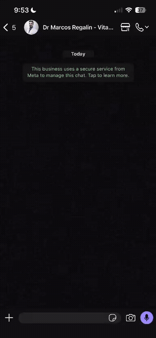
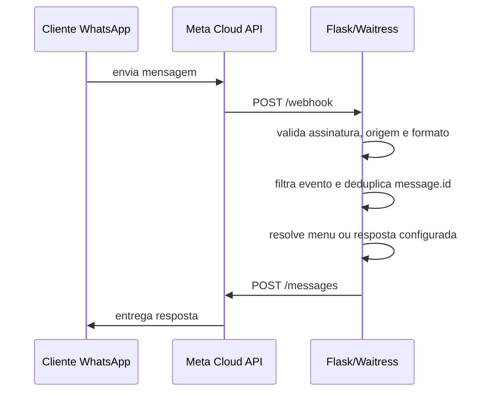

# WhatsApp First-Contact Bot

Bot em Python/Flask para automatizar o **primeiro atendimento** no WhatsApp Business Platform. Recebe eventos da Meta, valida origem e assinatura, apresenta menus interativos e responde com um catálogo local de mensagens — sem NLP, sem banco de dados, sem estado de conversa.

> Pensado para clínicas, consultórios e pequenos negócios que precisam de um filtro automatizado antes de passar a conversa para o atendimento humano.

## Demonstração



[Ver vídeo completo em MP4](docs/demo.mp4)

## Destaques

- Webhook compatível com a WhatsApp Cloud API.
- Menu inicial com botões interativos.
- Lista de opções secundárias para ampliar o atendimento sem texto livre.
- Respostas configuráveis em catálogo local.
- Pausa manual da automação por contato (takeover humano).
- Validação HMAC do webhook com `X-Hub-Signature-256`.
- Deduplicação simples por `message.id`.
- Rate limit básico por IP.
- Allowlist opcional de origem do webhook.
- Logs resumidos, com números mascarados e sem payload completo.
- Testes automatizados cobrindo os fluxos principais.

## Como funciona



Fluxo atual:

- mensagens como saudação ou `menu` abrem o menu inicial;
- botões do menu disparam respostas configuradas;
- a opção de "outros assuntos" abre uma lista interativa;
- respostas de lista disparam novas respostas configuradas;
- texto livre fora dos gatilhos conhecidos recebe uma resposta padrão;
- eventos de status, mídia ou payloads incompletos são ignorados;
- quando o contato está em atendimento humano manual, o bot fica silencioso.

## Pipeline de segurança do webhook

Cada `POST /webhook` passa por uma sequência fixa de gates antes de qualquer lógica de negócio. Cada gate corta o request com seu próprio status:

| # | Verificação | Falha retorna |
| - | --- | --- |
| 1 | `Content-Type: application/json` | `415` |
| 2 | IP de origem na allowlist (se configurada) | `403` |
| 3 | Rate limit por IP | `429` |
| 4 | Assinatura HMAC da Meta sobre o **corpo bruto** | `403` |

Só depois disso o JSON é parseado e o evento entra no roteador. O webhook **sempre retorna 200** quando passa pelos gates — mesmo se o envio de resposta para a Meta falhar — para evitar reentregas.

## Arquitetura

| Arquivo | Responsabilidade |
| --- | --- |
| [app.py](app.py) | App Flask, rotas, validação do webhook, roteamento e envio pela Meta |
| [messages.py](messages.py) | Catálogo local de gatilhos, botões, listas e respostas |
| [test_app.py](test_app.py) | Testes de webhook, segurança, roteamento e takeover humano |
| [.env.example](.env.example) | Modelo das variáveis de ambiente |

## Endpoints

| Método | Rota | Uso |
| --- | --- | --- |
| `GET` | `/` | Healthcheck |
| `GET` | `/webhook` | Verificação inicial da Meta |
| `POST` | `/webhook` | Recebimento de eventos assinados |
| `GET` | `/human-takeover` | Consulta da pausa manual por telefone |
| `POST` | `/human-takeover` | Ativa pausa manual por telefone |
| `DELETE` | `/human-takeover` | Remove pausa manual por telefone |

Healthcheck esperado:

```json
{"service":"whatsapp-bot","status":"ok"}
```

## Requisitos

- Python 3.11+
- Conta Meta com WhatsApp Business Platform
- `WHATSAPP_PHONE_NUMBER_ID`
- token com permissão para envio de mensagens
- webhook público HTTPS
- app inscrito no campo `messages`

## Início rápido

```powershell
python -m venv .venv
.\.venv\Scripts\activate
pip install -r requirements.txt
copy .env.example .env
```

Preencha o `.env` e rode os testes:

```powershell
.\.venv\Scripts\python.exe -m unittest -v
```

Suba o app:

```powershell
.\.venv\Scripts\python.exe app.py
```

Para teste local com URL pública:

```powershell
ngrok http 5000
```

Configure na Meta:

```text
https://SUA_URL_PUBLICA/webhook
```

## Variáveis de ambiente

Obrigatórias em operação normal:

```env
WHATSAPP_TOKEN=
WHATSAPP_PHONE_NUMBER_ID=
WHATSAPP_VERIFY_TOKEN=
META_APP_SECRET=
```

Recomendadas:

```env
WHATSAPP_GRAPH_API_VERSION=v23.0
PORT=5000
LOG_LEVEL=INFO
HUMAN_TAKEOVER_TOKEN=
```

Proteções opcionais:

```env
MESSAGE_DEDUP_TTL_SECONDS=900
MESSAGE_DEDUP_MAX_ENTRIES=5000
WEBHOOK_RATE_LIMIT_WINDOW_SECONDS=60
WEBHOOK_RATE_LIMIT_MAX_REQUESTS=300
TRUSTED_PROXY_IPS=
WEBHOOK_ALLOWED_IPS=
MAX_CONTENT_LENGTH=1048576
WAITRESS_THREADS=4
FLASK_DEBUG=
```

Fora de `FLASK_DEBUG`, o app falha cedo se `WHATSAPP_VERIFY_TOKEN` ou `META_APP_SECRET` estiverem ausentes.

## Atendimento humano (takeover)

O bot não detecta digitação humana automaticamente. A pausa é manual por telefone, protegida por um token administrativo.

Ativar:

```powershell
Invoke-RestMethod `
  -Method Post `
  -Uri http://localhost:5000/human-takeover `
  -Headers @{ "X-Admin-Token" = "SEU_TOKEN" } `
  -ContentType "application/json" `
  -Body '{"phone":"5511999999999"}'
```

Consultar:

```powershell
Invoke-RestMethod `
  -Method Get `
  -Uri "http://localhost:5000/human-takeover?phone=5511999999999" `
  -Headers @{ "X-Admin-Token" = "SEU_TOKEN" }
```

Liberar:

```powershell
Invoke-RestMethod `
  -Method Delete `
  -Uri http://localhost:5000/human-takeover `
  -Headers @{ "X-Admin-Token" = "SEU_TOKEN" } `
  -ContentType "application/json" `
  -Body '{"phone":"5511999999999"}'
```

## Personalização

Todo o comportamento conversacional fica concentrado em [messages.py](messages.py) — esse é o único arquivo que você precisa editar para adaptar o bot ao seu negócio. Ajuste:

- gatilhos que abrem o menu (`START_MENU_TRIGGERS`);
- rótulos dos botões (`INITIAL_MENU_BUTTONS`);
- itens da lista (`OTHER_MENU_ROWS`);
- IDs internos das opções (`INTERACTIVE_REPLY_OPTIONS`);
- respostas vinculadas a cada opção (`PREDEFINED_MESSAGES`);
- resposta padrão para texto livre (`DEFAULT_MESSAGE`).

O catálogo de exemplo é fictício (Clínica Aurora). **Evite publicar mensagens reais de clientes, links internos, nomes de profissionais, credenciais ou dados comerciais sensíveis.**

## Testes

```powershell
.\.venv\Scripts\python.exe -m unittest -v
```

A suíte cobre:

- healthcheck;
- verificação do webhook;
- assinatura inválida;
- content-type inválido;
- roteamento de botões e listas;
- eventos de status ignorados;
- múltiplas mensagens no mesmo payload;
- deduplicação por `message.id`;
- filtro por `phone_number_id`;
- rate limit;
- allowlist e proxy confiável;
- takeover humano;
- retorno `200` no webhook mesmo quando o envio externo falha.

## Limites atuais

- Não interpreta linguagem natural.
- Não mantém estado de conversa.
- Não persiste histórico em banco.
- Não envia mídia no fluxo atual.
- Não usa templates de mensagem no código atual.
- Deduplicação, rate limit e takeover ficam em memória.
- Várias instâncias exigiriam armazenamento compartilhado (Redis ou banco externo).

## Produção

Para produção, prefira:

- HTTPS fixo, sem ngrok;
- variáveis no provedor de hospedagem, não em `.env`;
- processo com restart automático;
- logs centralizados;
- rotação de tokens;
- monitoramento do healthcheck;
- revisão de privacidade antes de publicar o catálogo de mensagens.

Em modo normal, a aplicação usa Waitress. Em debug, usa o servidor embutido do Flask.

## Licença

MIT.
